# Chapter 34: Cloud-Native Petabyte Pipelines, GPU Acceleration, and Automated Testing for DEMs

*Software engineering at planetary scale: building reproducible, high-throughput, thoroughly tested elevation processing systems.*

---

## 34.4 Mathematical Foundations of Distributed Hydrology and Volumetric Invariants

Processing petabyte-scale elevation datasets in distributed environments requires algorithms whose mathematical complexity scales linearly or quasi-linearly with pixel count, and whose spatial operations can be verified by conservation laws. This section derives the exact mathematics of the **Priority-Flood $O(N \log N)$ depression-filling algorithm** with **parallel boundary-graph reduction**, and formulates the **Discrete Green's Theorem Volumetric Invariance** test.

```mermaid
flowchart TD
    subgraph MathFoundations34["Mathematical Formulations for Scalable DEM Engineering"]
        direction TB
        subgraph PriorityFloodMath["1. Priority-Flood Graph Inundation (Barnes et al. 2014)"]
            PriorityQueue["Priority Queue Q initialized with perimeter boundary cells\nExtract-Min operation: Pops lowest-elevation spill cell c"]
            NeighborCheck["Neighbor Update for cell n:\nIf z(n) <= z(c) => Depression Detected!\nFill elevation: z(n) = z(c)\nPush n to Priority Queue Q"]
            ComplexityProof["Time Complexity: O(N log N) using Min-Heap\nO(N) for integer/quantized grids using Radix Sort Priority Queues"]
            PriorityQueue --> NeighborCheck --> ComplexityProof
        end

        subgraph BoundaryReduction["2. Parallel Domain-Decomposition Graph Reduction"]
            TileGraph["Boundary Perimeter Graph G = (V_B, E_B)\nVertices: Tile edge cells\nEdge weights: Bottleneck spillover elevations"]
            GlobalSpill["Global Graph Priority-Queue Solve\nConnects inter-tile spill paths across distributed workers"]
            TileGraph --> GlobalSpill
        end

        subgraph GreensTheorem["3. Discrete Green's Theorem Volumetric Conservation"]
            GreenForm["Continuous Green's Theorem:\nDoubleIntegral_Omega ( dQ/dx - dP/dy ) dx dy = ContourIntegral_{partial Omega} ( P dx + Q dy )"]
            VolumeInvariance["Volumetric Invariant across Reprojection & Resampling:\nV = ContourIntegral_{partial Omega} [ Integral_0^x z(u, y) du ] dy == sum( z_ij * Delta_A_ij )"]
            GreenForm --> VolumeInvariance
        end
    end
```

---

### 34.4.1 The Priority-Flood Algorithm: Optimal Depression Filling

In hydrological modeling, a raw DEM contains thousands of small depressions (sinks, pits) caused by sensor noise, tree canopies, and interpolation artifacts. To route flow continuously to the ocean, depressions must be filled to their lowest spill point.

Historically, algorithms used iterative $O(N^2)$ depression-filling schemes (such as Jenson & Domingue 1988 or Planchon & Darboux 2001). The **Priority-Flood algorithm** (Barnes, Lehman, & Mulla 2014) proved that depression filling is mathematically isomorphic to an inward-marching front governed by a priority queue, solving the problem in **$O(N \log N)$** time.

#### 1. Algorithmic State and Initialization
Let the DEM be defined on a graph $G = (V, E)$ of $N$ cells. 
* Let $z(c)$ be the elevation of cell $c \in V$.
* Let $Q$ be a **min-priority queue** storing cells ordered strictly by their current elevation $z(c)$.
* Let $\text{visited}(c)$ be a boolean array tracking processed cells.

**Initialization:**
Push all outer boundary edge cells of the DEM (cells bordering the edge of the raster or ocean nodata cells) into the priority queue $Q$, and mark them as visited:
$$Q \leftarrow \big\{ c \in \partial \Omega \big\}, \quad \text{visited}(c) = \text{true}, \quad \forall c \in \partial \Omega$$

#### 2. The Inundation Invariant Loop
While $Q$ is not empty:
1. Pop the cell $c$ with the **minimum elevation** from $Q$:
   $$c \leftarrow \text{Extract-Min}(Q)$$
2. For each unvisited neighbor $n \in \mathcal{N}(c)$ (using 8-connectivity):
   * Mark $n$ as visited: $\text{visited}(n) = \text{true}$.
   * **The Inundation Condition:** If the neighbor's original elevation is less than or equal to $c$, it is trapped inside a depression:
     $$z(n) \leftarrow \max\big( z(n), \, z(c) \big)$$
   * Push $n$ into $Q$:
     $$\text{Insert}\big( Q, \, n \big)$$

#### 3. Mathematical Proof of Correctness
* **Theorem:** *Priority-Flood raises every cell in a depression to the exact elevation of the lowest saddle point connecting it to the outer boundary, without overfilling.*
* **Proof Sketch:** Because cells are popped from $Q$ in strictly non-decreasing order of elevation ($z(c_{k+1}) \ge z(c_k)$), the front advances into depressions strictly from the lowest accessible boundary spill point inward. When the front enters a depression, all interior cells lower than the spill elevation are raised to exactly $z_{\text{spill}}$. Because the queue is monotonic, no cell can be raised above its true spillway, and every cell is visited and modified **exactly once**.
* **Complexity:** Inserting and popping $N$ cells in a binary min-heap requires $O(\log N)$ per operation. The total computational complexity is **strictly $O(N \log N)$**. For integer-quantized elevations (e.g., millimeter or centimeter integers), replacing the binary heap with a **Radix Priority Queue** reduces complexity to **linear time $O(N)$**.

---

### 34.4.2 Parallel Domain-Decomposition and Boundary-Graph Reduction

To execute Priority-Flood across a distributed cloud cluster (where the DEM is split into $K$ tiles $T_1, \dots, T_K$ on separate machines), Barnes et al. (2016) developed **Boundary-Graph Reduction**:

#### 1. Intra-Tile Inundation
Each worker node loads tile $T_k$ and runs Priority-Flood using only its own perimeter edges as an initial boundary. Sinks contained entirely within the interior of the tile are filled immediately in parallel.

#### 2. The Perimeter Bottleneck Graph
For each tile $T_k$, the worker extracts an undirected graph $G_k = (V_k, E_k)$ where:
* Vertices $V_k = \partial T_k$ are the perimeter cells of the tile.
* For every pair of perimeter cells $u, v \in V_k$, an edge weight $w(u, v)$ represents the **minimum elevation path** connecting $u$ to $v$ across the interior of the tile:
  $$w(u, v) = \min_{\mathcal{P}_{u \to v}} \max_{c \in \mathcal{P}} z(c)$$
This compresses a $2048 \times 2048$ raster ($4.19\text{ million pixels}$) into a tiny 1D boundary graph of only $8,188\text{ perimeter vertices}$.

#### 3. Global Spillover Solution
The boundary graphs from all $K$ tiles are transmitted to a coordinator node and stitched along shared tile edges:
$$G_{\text{global}} = \bigcup_{k=1}^K G_k$$
The coordinator runs Priority-Flood on the compact global boundary graph, solving for the global spillover elevation $z_{\text{global}}(v)$ for every tile edge cell in seconds.

#### 4. Interior Adjustment
The updated boundary elevations are returned to the worker nodes, which execute a single sweep:
$$z_{\text{final}}(c) = \max\Big( z(c), \; \min_{v \in \partial T_k} \big[ z_{\text{global}}(v) \big] \Big)$$
This achieves **exact, mathematically bit-identical depression filling** to a monolithic serial run, but executes out-of-core across petabytes of distributed cloud storage.

---

### 34.4.3 Discrete Green's Theorem for Volumetric Conservation Invariants

When an automated pipeline reprojects, resamples, or filters a digital elevation model, an essential automated test is verifying **mass and volume conservation**.

Under Green's Theorem, the double integral of a scalar field over a 2D domain $\Omega$ is transformed into a line integral around the closed piecewise-smooth boundary $\partial\Omega$:

$$\iint_\Omega \left( \frac{\partial Q}{\partial x} - \frac{\partial P}{\partial y} \right) dx \, dy = \oint_{\partial \Omega} \big( P \, dx + Q \, dy \big)$$

#### 1. Formulating Volume as a Line Integral
The total volume $V$ beneath an elevation surface $z(x, y)$ above reference datum $z = 0$ is:
$$V = \iint_\Omega z(x, y) \, dx \, dy$$

Choose vector field components $P(x, y) = 0$ and $Q(x, y) = \int_0^x z(u, y) \, du$.
Then:
$$\frac{\partial Q}{\partial x} - \frac{\partial P}{\partial y} = z(x, y) - 0 = z(x, y)$$

Substituting into Green's Theorem yields the exact line integral for volume:

$$V = \oint_{\partial \Omega} \left[ \int_0^x z(u, y) \, du \right] dy$$

#### 2. The Discrete Conservation Test in CI/CD
Let a baseline elevation raster $z_A$ on grid $\Omega_A$ be reprojected into a target raster $z_B$ on grid $\Omega_B$ (e.g., from UTM Zone 10N to Conus Albers Equal Area).

The discrete volume on grid $A$ is:
$$V_A = \sum_{i, j \in \Omega_A} z_A(i, j) \cdot \Delta A_A$$

The discrete volume on grid $B$ is:
$$V_B = \sum_{k, l \in \Omega_B} z_B(k, l) \cdot \Delta A_B$$

* **The Volumetric Invariance Metric:**
  $$\frac{|V_A - V_B|}{V_A} \le \epsilon_{\text{vol}}$$
  * For conservative resampling (area-weighted average), $\epsilon_{\text{vol}} \le 10^{-5}$ ($0.001\%$).
  * For bilinear or bicubic resampling over rugged terrain, volume deviation must not exceed boundary Jacobian scale distortion tolerances ($\epsilon_{\text{vol}} \le 0.05\%$).
* If an automated CI/CD test detects $\frac{|V_A - V_B|}{V_A} > 0.001$, the pipeline automatically flags an unhandled cell-area projection distortion or an off-by-one pixel clipping error.
