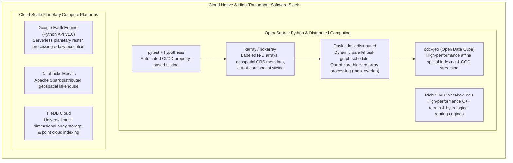

# Chapter 34: Cloud-Native Petabyte Pipelines, GPU Acceleration, and Automated Testing for DEMs

*Software engineering at planetary scale: building reproducible, high-throughput, thoroughly tested elevation processing systems.*

---

## 34.5 Software Ecosystem

Building petabyte-scale digital elevation pipelines requires an enterprise-grade software stack capable of orchestrating asynchronous task graphs, managing multi-terabyte chunked memory arrays, and enforcing strict automated testing. This section reviews the open-source libraries and commercial cloud platforms powering modern planetary-scale elevation engineering.



---

### 34.5.1 Open-Source Cloud-Native Python Stack

#### 1. `xarray` and `rioxarray`
The combination of `xarray` and `rioxarray` forms the backbone of modern scientific raster analysis in Python:
* **`xarray.DataArray`:** Wraps raw elevation arrays with explicit coordinate axes (`x`, `y`), variable attributes (`units="meters"`, `long_name="bare earth elevation"`), and time dimensions (`time`).
* **`rioxarray` Extension:** Integrates GDAL/Rasterio geospatial metadata directly into `xarray`, managing Coordinate Reference Systems (`crs`), affine geotransforms, spatial clipping (`clip`), and on-the-fly reprojection (`reproject`).

#### 2. `Dask` and `dask.distributed`
Dask enables parallelized, out-of-core computing across multi-core workstations or thousands of cloud instances:
* Divides large arrays into a grid of independent **Dask Chunks** (e.g., $2048 \times 2048$ blocks).
* Constructs a **Directed Acyclic Graph (DAG)** of operations (lazy evaluation), optimizing memory consumption and executing tasks in parallel across worker threads.
* Implements `map_overlap` to manage tile halos and buffer aprons seamlessly.

```python
"""
Cloud-native out-of-core elevation processing pipeline using xarray, rioxarray, and Dask.
Demonstrates chunked processing of a multi-gigabyte DEM, computing hillshade,
and writing directly to a Cloud Optimized GeoTIFF (COG).
"""

import xarray as xr
import rioxarray
import dask.array as da
import numpy as np

def compute_chunked_hillshade(dem_da: xr.DataArray, azimuth: float = 315.0, altitude: float = 45.0) -> xr.DataArray:
    """
    Computes shaded relief across out-of-core chunked Dask arrays with zero edge seams.
    """
    res_x = abs(float(dem_da.rio.resolution()[0]))
    res_y = abs(float(dem_da.rio.resolution()[1]))
    
    az_rad = np.radians(azimuth)
    alt_rad = np.radians(altitude)
    
    def _hillshade_kernel(block):
        # block is guaranteed to have 1-pixel halo on all sides
        z = block
        dz_dx = ((z[:-2, 2:] + 2 * z[1:-1, 2:] + z[2:, 2:]) - 
                 (z[:-2, :-2] + 2 * z[1:-1, :-2] + z[2:, :-2])) / (8.0 * res_x)
        dz_dy = ((z[2:, :-2] + 2 * z[2:, 1:-1] + z[2:, 2:]) - 
                 (z[:-2, :-2] + 2 * z[:-2, 1:-1] + z[:-2, 2:])) / (8.0 * res_y)
        
        slope = np.arctan(np.sqrt(dz_dx**2 + dz_dy**2))
        aspect = np.arctan2(dz_dy, -dz_dx)
        
        # Lambertian hillshade formula
        shaded = np.sin(alt_rad) * np.cos(slope) + np.cos(alt_rad) * np.sin(slope) * np.cos(az_rad - aspect)
        shaded_u8 = np.clip(255.0 * np.maximum(0.0, shaded), 0, 255).astype(np.uint8)
        return np.pad(shaded_u8, pad_width=1, mode='edge')

    # Execute out-of-core parallel mapping with 1-pixel halo
    dask_data = dem_da.data
    shaded_dask = da.map_overlap(
        _hillshade_kernel,
        dask_data,
        depth=1,
        boundary='reflect',
        trim=True,
        dtype=np.uint8
    )
    
    # Wrap back into rioxarray DataArray
    hillshade_da = xr.DataArray(
        shaded_dask,
        coords=dem_da.coords,
        dims=dem_da.dims,
        attrs={"long_name": "Analytical Shaded Relief", "units": "DN"}
    )
    hillshade_da.rio.write_crs(dem_da.rio.crs, inplace=True)
    return hillshade_da

def run_production_pipeline(input_cloud_cog: str, output_cog_path: str):
    """Executes distributed pipeline and writes Cloud Optimized GeoTIFF."""
    print(f"Opening cloud asset: {input_cloud_cog}")
    # Open lazily with Dask chunks of 2048x2048
    dem = rioxarray.open_rasterio(input_cloud_cog, chunks={"x": 2048, "y": 2048})
    
    print("Executing out-of-core hillshade task graph...")
    hillshade = compute_chunked_hillshade(dem.squeeze())
    
    print(f"Exporting Cloud Optimized GeoTIFF: {output_cog_path}")
    hillshade.rio.to_raster(
        output_cog_path,
        driver="COG",
        compress="DEFLATE",
        tiled=True,
        blockxsize=512,
        blockysize=512
    )
    print("Pipeline completed successfully.")
```

#### 3. RichDEM and WhiteboxTools
* **RichDEM:** A high-performance C++ terrain analysis library developed by Richard Barnes. Provides optimized SIMD implementations of flow accumulation, Priority-Flood depression filling, and terrain curvature, processing hundreds of millions of cells in seconds.
* **WhiteboxTools:** Developed by John Lindsay (University of Guelph) in Rust. Features over 500 advanced geomorphometric and hydrological tools designed for multi-threaded parallel execution.

---

### 34.5.2 Commercial Cloud and Enterprise Engines

#### 1. Google Earth Engine (Python API v1.0+)
Google Earth Engine provides serverless execution across planetary elevation catalogs:
* Automatically partitions computation into dynamic quadtree pyramids.
* Executes map-reduce algorithms lazily across thousands of Google Cloud compute instances.
* The modern Earth Engine Python API (v1.0+, 2024) integrates directly with Xarray and Apache Arrow, enabling seamless data transfer between Google's cloud catalog and open-source scientific workflows.

#### 2. Databricks Mosaic
An enterprise geospatial framework built directly into the Databricks Lakehouse:
* Extends Apache Spark SQL with native spatial indexing (H3, S2, BNG).
* Distributes spatial joins and multi-resolution raster math across petabyte data lakes, enabling insurance and logistics corporations to evaluate national flood models at massive scale.

#### 3. TileDB Cloud
A commercial multi-dimensional array database engine:
* Native storage format for dense rasters and sparse 3D point clouds (LiDAR).
* Eliminates flat file hierarchies by providing serverless SQL queries and Python/C++ array access directly over S3/GCS buckets with role-based access control (RBAC).
