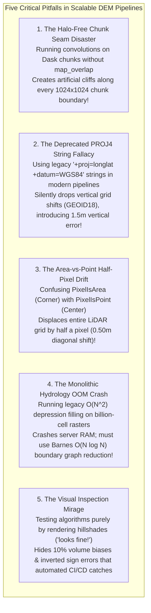

# Chapter 34: Cloud-Native Petabyte Pipelines, GPU Acceleration, and Automated Testing for DEMs

*Software engineering at planetary scale: building reproducible, high-throughput, thoroughly tested elevation processing systems.*

---

## 34.6 Common Pitfalls and Key Takeaways

Scaling digital elevation models to petabyte cloud architectures and automated pipelines exposes software systems to subtle, catastrophic engineering traps. Because geospatial data structures can be corrupted without triggering code exceptions, engineering teams must maintain continuous vigilance against silent coordinate shifts, boundary seams, and legacy projection strings.

---

### 34.6.1 Common Pitfalls in Cloud-Native DEM Engineering



#### 1. The Halo-Free Chunk Seam Disaster
* **The Failure Mode:** A data engineer implements parallel hillshading or slope calculation across a multi-terabyte raster using Dask or PySpark, processing each $2048\times 2048$ chunk independently with a standard $3\times 3$ NumPy gradient function.
* **Algorithmic Reality:** Finite-difference operators require neighboring pixels outside the chunk boundary. At tile edges, boundary cells lack neighbors and are clamped or zero-padded.
* **Forensic Consequence:** Every single chunk boundary displays a permanent, visible line of **artificial cliffs and zero-gradient strips**. When the state-wide or continental mosaic is published, users observe a giant grid of square lines across the landscape.
* **Remedy:** Always wrap spatial convolutions and neighborhood filters in **`da.map_overlap`**, specifying a halo depth at least equal to the filter radius ($W_{\text{halo}} \ge R_{\text{filter}}$) with automated boundary trimming.

#### 2. The Deprecated PROJ4 String Fallacy
* **The Failure Mode:** A developer or AI coding assistant configures a coordinate transformation pipeline using a legacy PROJ4 string:
  ```text
  "+proj=utm +zone=10 +ellps=GRS80 +datum=NAD83 +units=m +no_defs"
  ```
* **Geodetic Reality:** Under PROJ version 6 and above, the legacy PROJ4 string syntax was officially deprecated. PROJ4 strings cannot represent compound 3D coordinate reference systems, realization epochs, or vertical geoid grids.
* **Forensic Consequence:** When GDAL encounters a PROJ4 string, it silently ignores complex vertical datum transformations (such as NGS GEOID18 or NOAA VDatum), falling back to a coarse 3-parameter datum transformation. **Every elevation coordinate is silently corrupted by $1.0\text{ to }2.0\text{ meters}$ vertically**, without throwing a single software error or warning!
* **Remedy:** Ban all `+proj=` strings in production pipelines. Mandate **authoritative EPSG codes** (e.g., `EPSG:6349` for compound NAD83 2011 + NAVD88) or **OGC WKT2 (ISO 19162)** strings.

#### 3. The `PixelIsArea` vs. `PixelIsPoint` Half-Pixel Drift
* **The Failure Mode:** An elevation resampling pipeline maps raster pixels to geospatial coordinates assuming that the upper-left coordinate $(x_0, y_0)$ in the affine transform represents the **center of the pixel** (`PixelIsPoint`), when the GeoTIFF metadata explicitly declares **`PixelIsArea` (corner registration)**.
* **Geometric Reality:** The origin of a `PixelIsArea` raster is the outer corner of the top-left cell. Its center point sits at $(x_0 + \frac{\Delta x}{2}, y_0 - \frac{\Delta y}{2})$.
* **Forensic Consequence:** The entire digital elevation model is shifted diagonally by **half a pixel**:
  $$\Delta x = +0.5 \cdot \text{res}_x, \quad \Delta y = -0.5 \cdot \text{res}_y$$
  On a $1\text{-meter}$ USGS 3DEP LiDAR model, this introduces a permanent **$0.71\text{-meter}$ diagonal horizontal displacement**. Building footprints no longer align with LiDAR foundations, and stream channels are shifted onto banklines.
* **Remedy:** Program automated assertions in your data loaders verifying the `AREA_OR_POINT` metadata tag and enforcing consistent half-pixel coordinate offsets.

#### 4. The Monolithic Hydrology Out-of-Memory (OOM) Crash
* **The Failure Mode:** A GIS technician attempts to run hydrological depression filling and flow routing on a 10-billion-cell regional LiDAR DTM using legacy single-threaded algorithms (such as the standard ArcHydro or legacy GRASS fill modules).
* **Computational Reality:** Legacy depression-filling algorithms scale as $O(N^2)$ or $O(N^{1.5})$ in memory and CPU time.
* **Forensic Consequence:** After running for 72 hours, the host server runs out of memory (OOM), triggers the Linux kernel OOM killer, and terminates the process, leaving temporary files in an unrecoverable state.
* **Remedy:** Deploy **Barnes Priority-Flood** with **Boundary-Graph Reduction**, which runs in $O(N \log N)$ time and processes massive rasters out-of-core across distributed worker nodes with a negligible memory footprint.

#### 5. The Visual Inspection Mirage
* **The Failure Mode:** An engineering team verifies an elevation processing pipeline purely by loading the output into a GIS viewer, rendering a hillshade, and declaring: *"The mountains look crisp, so the code must be working!"*
* **Scientific Reality:** Human visual inspection cannot detect a $1.5\text{-meter}$ vertical datum bias, a $0.5\text{-pixel}$ horizontal shift, or a $5\%$ volumetric mass loss resulting from bicubic resampling ringing.
* **Forensic Consequence:** Severe systematic biases remain undiscovered until construction contractors uncover massive cut-and-fill discrepancies during earthwork excavation.
* **Remedy:** Enforce automated CI/CD unit testing against **synthetic mathematical test surfaces** (paraboloids, planes) with exact analytical derivatives, and enforce discrete conservation laws ($\min(\text{nDSM}) \ge 0$, volume invariance within $0.01\%$).

---

### 34.6.2 Key Takeaways for Practitioners

1. **Manage Tile Halos in Parallel Workflows:** Convolutions and filters require an overlapping halo buffer ($W_{\text{halo}} \ge R_{\text{filter}}$); use `dask.array.map_overlap` to eliminate square boundary scars.
2. **Never Use PROJ4 Strings:** PROJ4 syntax silently strips vertical datum shift grids. Mandate OGC WKT2 or authoritative EPSG compound codes.
3. **Verify Pixel Center vs. Corner Registration:** Prevent $0.5\text{-pixel}$ horizontal shifts by explicitly asserting `PixelIsArea` vs. `PixelIsPoint` geotransform conventions.
4. **Deploy Priority-Flood for Scalable Hydrology:** Replace $O(N^2)$ depression-filling with Barnes Priority-Flood ($O(N \log N)$) and parallel boundary-graph reduction for petabyte-scale watersheds.
5. **Verify Algorithms Against Analytical Truth:** Never test terrain derivatives on real LiDAR; verify code against synthetic paraboloids, planes, and Gaussian hills with exact mathematical solutions.
