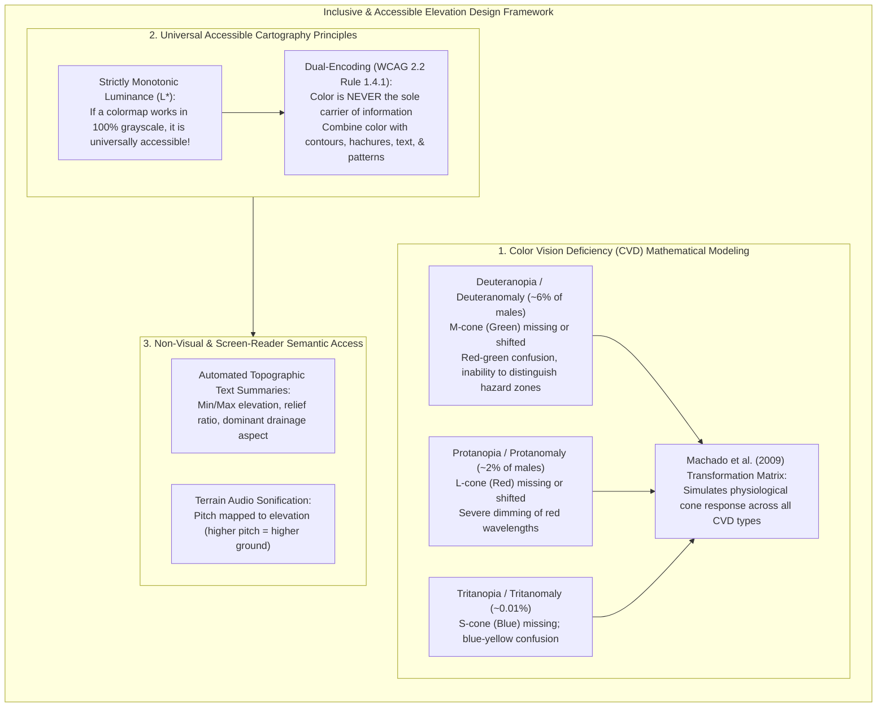

# Chapter 35: Accessibility, Physical/Tactile Terrain Models, and Field Augmented Reality (AR)

*Bringing elevation data off the 2D monitor: inclusive design, 3D-printed/CNC solid terrain, and in-situ augmented reality.*

---

## 35.1 Accessible and Colorblind-Safe Elevation Design

For decades, digital elevation cartography has been designed under the unspoken assumption that every user possesses typical trichromatic color vision and interacts with terrain solely through a standard two-dimensional computer monitor. In reality, **over $8\%$ of men and $0.5\%$ of women** live with Color Vision Deficiency (CVD), millions of individuals navigate with low vision or blindness, and emergency responders in the field require hands-on, high-contrast, or audio-tactile interfaces.

An inaccessible elevation map is a public safety hazard. When an emergency evacuation map uses a red-green color ramp to denote flood danger, a deuteranopic resident cannot distinguish safe high ground from a submerged death trap. Designing truly accessible elevation products requires mathematically modeling human color perception deficiencies, enforcing dual-encoding principles, and developing screen-reader-accessible terrain semantics.



---

### 35.1.1 The Neurobiology and Mathematics of Color Vision Deficiency

Human color perception is trichromatic, mediated by three classes of retinal cone photoreceptors:
* **S-Cones (Short Wavelength):** Peak sensitivity near $\lambda \approx 420\text{ nm}$ (Blue).
* **M-Cones (Medium Wavelength):** Peak sensitivity near $\lambda \approx 530\text{ nm}$ (Green).
* **L-Cones (Long Wavelength):** Peak sensitivity near $\lambda \approx 560\text{ nm}$ (Red).

#### 1. The Taxonomy of Color Vision Deficiencies
* **Deuteranopia (Dichromacy) & Deuteranomaly (Anomalous Trichromacy):** The most common form of CVD ($\sim 6\%$ of males). The M-cone pigment is either absent or shifted in spectral sensitivity toward the L-cone. Red and green hues collapse onto an identical yellowish-gray axis.
* **Protanopia & Protanomaly ($\sim 2\%$ of males):** The L-cone pigment is absent or shifted. Long-wavelength red light appears significantly darker, and reds and greens are confused.
* **Tritanopia & Tritanomaly ($\sim 0.01\%$ of the population):** The S-cone pigment is absent; blue and yellow hues are confused.
* **Monochromacy / Achromatopsia (1 in 30,000):** Complete absence of functioning cone photoreceptors; vision is mediated entirely by rods, perceiving only achromatic luminance ($L^*$).

#### 2. The Machado et al. (2009) Color Vision Deficiency Simulation
To verify whether an elevation colormap is accessible, software pipelines simulate how colors appear to individuals with CVD. Under the Machado, Oliveira, and Fernandes (2009) physiologically-based model, an RGB color vector $\mathbf{C} = (R, G, B)^T$ is transformed into a CVD-perceived color $\mathbf{C}_{\text{CVD}}$ via a $3\times 3$ chromatic transformation matrix:

$$\mathbf{C}_{\text{CVD}} = \mathbf{M}_{\text{CVD}}(\text{type}, s) \cdot \mathbf{C}$$
where $s \in [0, 1]$ represents the severity of the deficiency ($s = 1.0$ for complete dichromacy).

*For complete Deuteranopia ($s = 1.0$):*
$$\mathbf{M}_{\text{deuteranopia}} = \begin{pmatrix} 0.3673 & 0.8606 & -0.2280 \\ 0.2801 & 0.6725 & 0.0474 \\ -0.0118 & 0.0430 & 0.9688 \end{pmatrix}$$

*For complete Protanopia ($s = 1.0$):*
$$\mathbf{M}_{\text{protanopia}} = \begin{pmatrix} 0.1523 & 1.0526 & -0.2049 \\ 0.1145 & 0.7863 & 0.0992 \\ -0.0039 & -0.0481 & 1.0520 \end{pmatrix}$$

* **The CI/CD Accessibility Linter:** 
  An automated testing pipeline simulates deuteranopia and protanopia across the entire elevation color palette. If the minimum perceptual color difference $\Delta E_{00}$ between adjacent elevation steps drops below a threshold ($\Delta E_{00} < 3.0$), the colormap is flagged as non-compliant.

---

### 35.1.2 Designing Universal, Accessible Elevation Palettes

#### 1. The Monotonic Luminance Invariant
The single most powerful rule in accessible cartography is **monotonic lightness**:
* If perceived lightness $L^*$ in CIELAB or CAM02-UCS space increases or decreases strictly monotonically with elevation $z$, the elevation surface **preserves 100% of its visual contrast when converted to grayscale**.
* Palettes like `batlow`, `viridis`, `cividis`, and `cmocean.deep` maintain clear spatial separation under any form of color vision deficiency or monochrome printing.

#### 2. The Dual-Encoding Requirement (WCAG 2.2)
Under the W3C Web Content Accessibility Guidelines (WCAG 2.2, Success Criterion 1.4.1: *Use of Color*):
> *"Color is not used as the only visual means of conveying information, indicating an action, prompting a response, or distinguishing a visual element."*

To satisfy WCAG 2.2 on elevation and hazard products:
* **Contours + Shading:** Always overlay labeled contour lines or index contours on top of color-tinted elevation rasters.
* **Texture and Hatching:** Differentiate high-risk flood zones or shallow bathymetric shoals using diagonal cross-hatching, stippling dots, or boundary patterns in addition to color fills.
* **Direct Typography:** Annotate critical elevation thresholds directly with text labels (e.g., `"BASE FLOOD ELEVATION: 12.4m"`), ensuring that readers do not have to match ambiguous colors to a legend.

---

### 35.1.3 Non-Visual Access: Screen Readers and Audio Sonification

How does a completely blind or severely visually impaired individual interpret a digital elevation model? Accessible GIS requires translating 2D and 3D spatial surfaces into non-visual semantic formats.

#### 1. Automated Topographic Semantic Summaries
Modern accessible web pipelines generate automated natural-language terrain summaries from DEM metadata and zonal statistics, which are embedded directly into HTML `<figure>` and `<figcaption>` elements:

```html
<!-- Accessible Semantic Elevation Summary for Screen Readers -->
<figure>
  
  <figcaption class="sr-only">
    <h3>Topographic Accessibility Summary: Boulder Creek Watershed</h3>
    <p><strong>Geographic Domain:</strong> 15 km east-west by 12 km north-south.</p>
    <p><strong>Elevation Range:</strong> Minimum 1,620 meters in the eastern plains, rising to maximum 3,140 meters at Green Mountain.</p>
    <p><strong>Dominant Landforms:</strong> The western 60% consists of steep granitic foothills with slopes exceeding 35 degrees, draining eastward through Boulder Canyon. The eastern 40% transitions into flat alluvial plains with slopes under 2 degrees.</p>
    <p><strong>Flood Hazard:</strong> 14% of the mapped area sits within the 100-year regulatory flood zone bordering Boulder Creek.</p>
  </figcaption>
</figure>
```

#### 2. Interactive Terrain Audio Sonification
Pioneered in assistive technology research, **terrain sonification** maps geographic coordinates $(x, y)$ and elevation $z$ to acoustic audio frequencies:
* As a user moves a finger across a touchscreen tablet or moves a cursor across a web map, the computer plays an acoustic tone.
* **Pitch Mapping:** Acoustic frequency scales logarithmically with elevation:
  $$f_{\text{audio}}(z) = f_0 \cdot 2^{\frac{z - z_{\min}}{z_{\max} - z_{\min}} \cdot k_{\text{octaves}}}$$
  Valleys hum at deep bass frequencies ($100\text{–}200\text{ Hz}$); mountain peaks ring at high treble tones ($1,000\text{–}2,000\text{ Hz}$).
* **Stereo Panning:** The stereo audio balance pans left-to-right matching the horizontal $x$-coordinate, while timbre (roughness or modulation) communicates terrain slope, enabling blind users to rapidly trace ridgelines and stream networks through sound alone.
