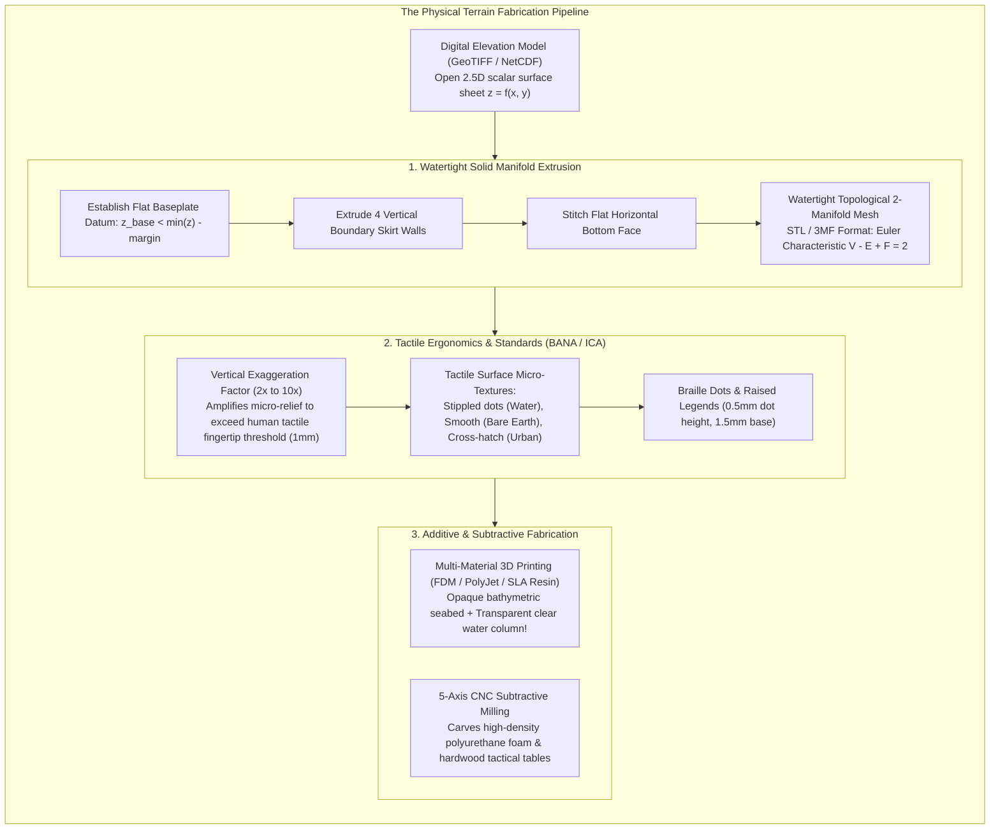
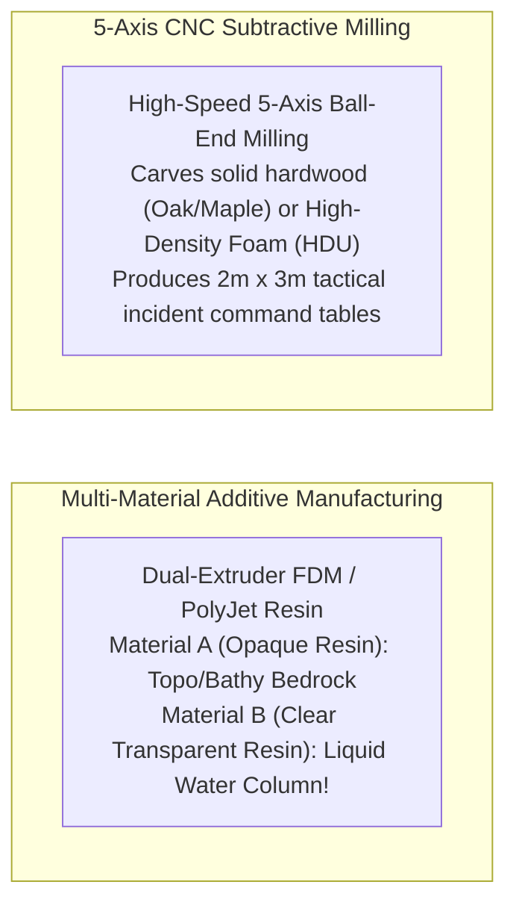

# Chapter 35: Accessibility, Physical/Tactile Terrain Models, and Field Augmented Reality (AR)

*Bringing elevation data off the 2D monitor: inclusive design, 3D-printed/CNC solid terrain, and in-situ augmented reality.*

---

## 35.2 Physical and Tactile Terrain Models: 3D Printing and CNC Milling

While digital elevation models live inside computer memory, human beings interact most intimately with physical matter. For centuries, military commanders, geologists, and educators relied on physical relief models—painstakingly sculpted from plaster, papier-mâché, clay, or laminated cardboard contours.

Today, additive manufacturing (3D printing) and subtractive 5-axis computer numerical control (CNC) milling allow practitioners to transform digital rasters into physical, touchable terrain models. These physical artifacts serve two vital purposes: they provide **tactile cartographic independence for blind and low-vision individuals**, and they provide tangible, multi-material spatial models for emergency incident command tables, watershed education, and museum exhibits.

---

### 35.2.1 From 2.5D Rasters to Watertight 3D Solids

A digital elevation raster or TIN is an "open sheet": it has an upper surface, but zero thickness, zero side walls, and no bottom. If an unclosed raster surface is loaded into 3D printer slicing software (such as PrusaSlicer, Bambu Studio, or Cura), the slicing engine fails with non-manifold topological errors.

To fabricate a physical model, the open surface must be transformed into a **watertight, closed 2-manifold solid volume**:

#### 1. The Solid Extrusion Geometry
1. **Define the Baseplate Elevation ($z_{\text{base}}$):**
   Identify the absolute minimum elevation within the dataset ($z_{\min} = \min_{(x, y)} z(x, y)$). Establish a flat horizontal baseplate elevation at a safe structural offset:
   $$z_{\text{base}} = z_{\min} - \Delta z_{\text{margin}}$$
   where $\Delta z_{\text{margin}}$ (typically $2\text{–}5\text{ mm}$ at model scale) ensures that the lowest valley or ocean trench maintains sufficient structural plastic thickness so the model does not break during printing.
2. **Generate the Four Vertical Skirt Walls:**
   For every boundary edge vertex $(x_b, y_b, z(x_b, y_b))$ along the outer perimeter neatline, create a corresponding base vertex $(x_b, y_b, z_{\text{base}})$. Connect adjacent perimeter pairs to form vertical rectangular side walls, triangulated into planar quads.
3. **Generate the Closed Bottom Baseplate:**
   Construct a flat horizontal bottom polygon at $z = z_{\text{base}}$ spanning the outer coordinates, triangulated with inward-facing surface normals.
4. **Enforce Watertight Manifold Topology:**
   Ensure every edge is shared by **exactly two triangular facets**, and verify that the closed surface integral of outward normal vectors equals zero:
   $$\oint_{\partial \mathcal{V}} \hat{\mathbf{n}} \, dA = \mathbf{0}$$

#### 2. Mesh Decimation and Format Standards: STL vs. 3MF
* **The Triangle Polygon Budget:** A $1\text{-meter}$ LiDAR raster of a $10\text{ km} \times 10\text{ km}$ county contains $100\text{ million pixels}$ ($200\text{ million triangles}$). Loading this directly into a slicer causes memory exhaustion. Mesh decimation algorithms (such as Garland-Heckbert Quadric Error Metrics - QEM) simplify the mesh down to $1\text{–}3\text{ million triangles}$, preserving full edge sharpness on ridgelines while simplifying flat plains into large triangles.
* **STL vs. 3MF:** The legacy Stereolithography (`.stl`) format stores only raw triangle vertex coordinates without units, color, or coordinate metadata. Modern pipelines use the **3D Manufacturing Format (`.3mf`)**, an open XML-ZIP container that stores multi-material boundaries, full color textures, millimeter units, and slice geometry in a fraction of the file size.

---

### 35.2.2 Tactile Cartography Standards for Blind and Low-Vision Users

A sighted user perceives terrain via 2D visual perspective, analytical shading, and color hypsometry. A blind or visually impaired user perceives terrain through the **somatosensory system (active haptic exploration with fingertips)**. Designing a tactile terrain model requires understanding tactile spatial resolution and standardizing haptic symbology under the guidelines of the **Braille Authority of North America (BANA)** and the **International Cartographic Association (ICA)**.

#### 1. The Human Tactile Threshold and Vertical Exaggeration
The human fingertip has a spatial two-point discrimination threshold of approximately **$1.5\text{ to }2.5\text{ millimeters}$**, and can detect vertical surface steps as small as **$0.2\text{ millimeters}$**.
* **The Flat Earth Reality:** Real-world planetary topography is exceptionally flat. On a true-scale $1:100,000$ model of the Grand Canyon ($10\text{ cm}$ wide), a $1,500\text{-meter}$ canyon depth corresponds to a physical indentation of only **$1.5\text{ millimeters}$**! Rolling hills and river channels have relief less than $0.1\text{ mm}$, making them completely imperceptible to human touch.
* **Mandatory Vertical Exaggeration ($VE$):**
  To make topography legible to touch, tactile models must apply a **Vertical Exaggeration Factor**:
  $$z_{\text{model}} = z_{\text{base}} + VE \cdot \big( z(x, y) - z_{\text{base}} \big)$$
  * In rugged alpine terrain (Alps, Rocky Mountains): $VE = 1.5\times\text{ to }3.0\times$.
  * In moderate rolling foothills: $VE = 3.0\times\text{ to }6.0\times$.
  * In low-relief coastal floodplains: $VE = 10.0\times\text{ to }20.0\times$.

#### 2. Stepped Contour Terracing vs. Smooth Relief
* **Smooth Relief:** Provides intuitive, organic tactile exploration of natural landforms, mountain ridges, and drainage divides.
* **Stepped Contour Terraces:** Instead of smooth surfaces, the model is fabricated as discrete, stair-stepped vertical layers (e.g., $100\text{-meter}$ contour steps). Each step provides an unambiguous, sharp tactile edge that allows blind users to count elevation intervals directly with their fingers, bridging qualitative shape with quantitative measurement.

#### 3. Standard Tactile Surface Micro-Textures and Braille
Under BANA tactile cartography guidelines:
* **Waterbodies (Oceans / Lakes):** Depicted as perfectly smooth, polished depressions, or engraved with fine, parallel wave lines.
* **Urban / Built Environments:** Texturized with raised cross-hatching or sandpaper stippling.
* **Stream Thalwegs:** Engraved as continuous concave grooves ($1.0\text{ mm}$ wide, $0.5\text{ mm}$ deep) that fingers can easily follow downstream.
* **Braille Annotations:** Mountain summits and major cities are labeled in Grade 2 Braille. Standard Braille specifications dictate:
  $$\text{Braille Dot Height: } 0.45\text{–}0.55\text{ mm}, \quad \text{Dot Base Diameter: } 1.4\text{–}1.6\text{ mm}, \quad \text{Dot Spacing: } 2.3\text{–}2.5\text{ mm}$$

---

### 35.2.3 Advanced Additive and Subtractive Fabrication Modalities

#### 1. Multi-Material Resin 3D Printing: The Transparent Water Column
One of the most spectacular breakthroughs in modern bathymetric modeling is **multi-material photopolymer jetting (e.g., Stratasys PolyJet, Formlabs SLA)**:
* **The Seabed:** The bathymetric seafloor—complete with submarine canyons, seamounts, and tectonic fracture zones—is printed in solid, full-color opaque resin with Haxby or `cmocean.deep` color tints.
* **The Water Column:** The overlying ocean is printed simultaneously out of **optically clear, polished transparent resin** cast up to the Mean High Water surface!
* *The Result:* Observers see and touch a physical block of the ocean: looking through the glassy transparent surface reveals the submerged canyons in true three dimensions, while ships or infrastructure models can be embedded directly at their true operational depths.

#### 2. 5-Axis CNC Milling for Tactical Incident Command Tables
While 3D printing is ideal for small desktop models ($<30\text{ cm}$), regional planning and military operations require massive relief tables spanning multiple meters:
* **Subtractive Milling:** High-speed 5-axis computer numerical control (CNC) routers equipped with diamond ball-end mills carve digital elevation models out of large blocks of **High-Density Urethane (HDU) tooling foam**, dense polystyrene, or glued hardwood planks.
* **Tactical Command Sand Tables:** These durable $2\text{ m} \times 3\text{ m}$ physical terrain tables are installed in emergency disaster response centers (e.g., wildfire incident command posts or flood control centers). Overhead laser projectors project real-time satellite wildfire perimeters, thermal hotspots, and dynamic flood inundation vectors directly onto the 3D physical terrain, enabling incident commanders to touch the topography while coordinating evacuation operations.
