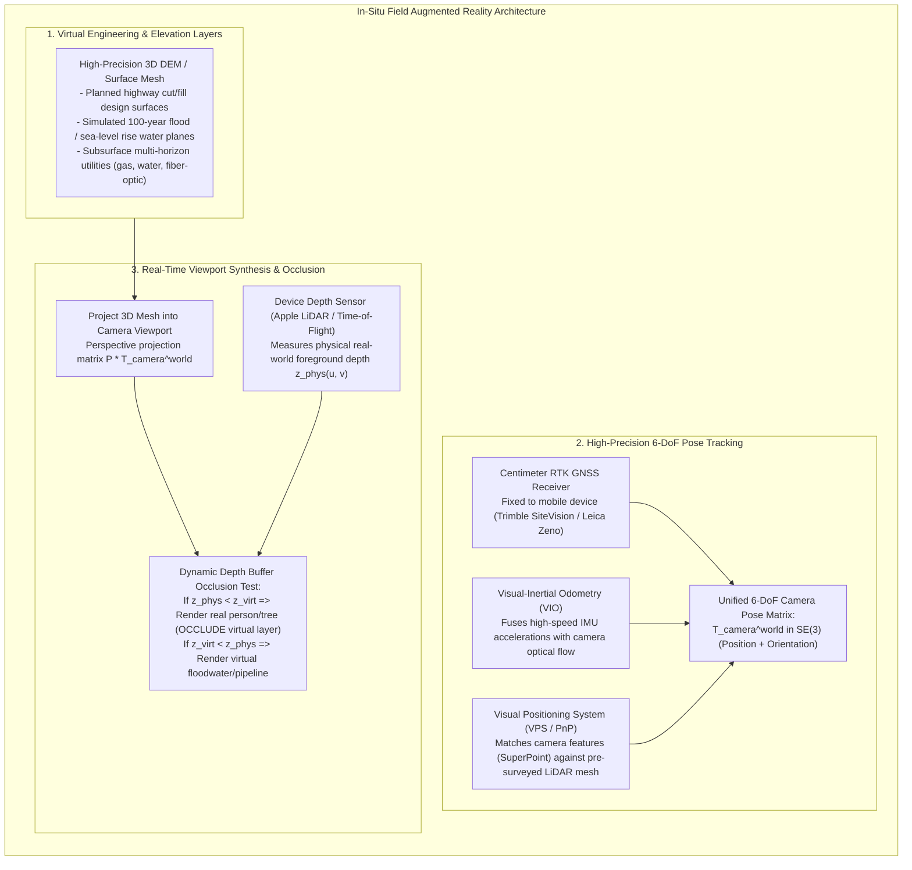
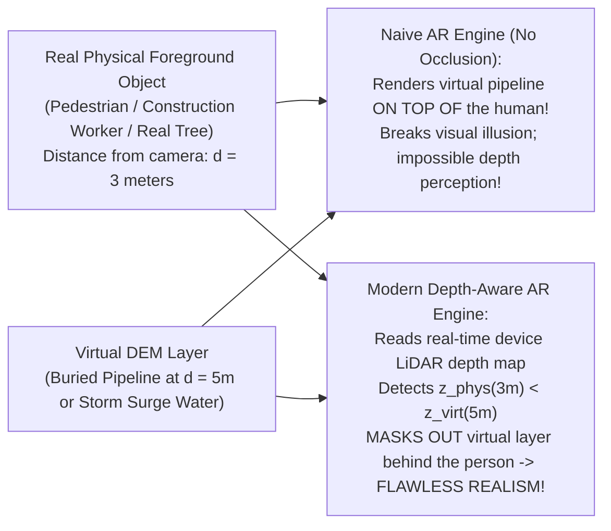

# Chapter 35: Accessibility, Physical/Tactile Terrain Models, and Field Augmented Reality (AR)

*Bringing elevation data off the 2D monitor: inclusive design, 3D-printed/CNC solid terrain, and in-situ augmented reality.*

---

## 35.3 Field Augmented Reality (AR) and Virtual Globes

The ultimate frontier of elevation visualization is bringing digital terrain off the screen and projecting it directly into the physical landscape. Through **Field Augmented Reality (AR)**, civil engineers, construction crews, utility workers, and emergency responders look through mobile tablets or heads-up smart glasses to see the invisible: peeling back the grass to inspect buried high-pressure gas pipelines, projecting future Category 4 storm surge levels onto real coastal neighborhoods, and visualizing cut-and-fill grading planes directly on a highway construction site.

However, field AR faces a brutal physical challenge: **geodetic registration**. Aligning a virtual 3D elevation mesh with the physical world to within millimeter or centimeter tolerances requires fusing **RTK GNSS**, **Visual-Inertial Odometry (VIO)**, **Visual Positioning Systems (VPS)**, and real-time **dynamic occlusion handling**.

---

### 35.3.1 Operational Applications of Field Augmented Reality

Field AR transforms digital elevation models into active real-time operational decision tools:

#### 1. "Seeing Into the Ground": Subsurface Utility Strike Prevention
During urban excavation, construction backhoes accidentally striking buried underground utilities (high-pressure natural gas mains, fiber-optic cables, high-voltage electric lines) cause billions of dollars in infrastructure damage and fatal explosions.
* Field AR systems ingest **multi-horizon subsurface utility DEMs** (surveyed via Ground-Penetrating Radar and vacuum excavation potholing).
* Looking through a tablet, an excavator operator sees a high-contrast holographic rendering of the gas pipeline glowing red beneath the asphalt road, complete with depth callouts (`"DEPTH TO PIPE: 1.45m"`), preventing catastrophic utility strikes.

#### 2. Visualizing Future Sea-Level Rise and Flood Inundation
During public town halls or coastal resilience planning, showing community members a 2D blue-colored map often fails to convey physical risk.
* Using mobile AR apps on smartphones, residents stand on their front porches and look toward the ocean:
* The system projects a dynamic, photorealistic **3D water plane** reflecting future storm surge elevations ($+2.5\text{ meters}$).
* Users see simulated ocean water lapping against their real front steps, submerging their parked cars, and flooding their living rooms in true scale, driving urgent community consensus for flood mitigation infrastructure.

#### 3. Earthwork Construction Machine Guidance
On civil grading sites, bulldozers and motor graders traditionally relied on wooden grade stakes driven into the dirt by surveyors:
* With field AR, site superintendents look across an open grading pit to see the **planned design DTM** floating in space:
* The system color-codes the landscape: areas requiring excavation glow red (cut), while areas requiring fill glow blue, eliminating weeks of manual staking delays.

---

### 35.3.2 The Geodetic Registration Problem: Achieving Centimeter Alignment

Projecting a virtual 3D mesh into a real camera video stream requires solving for the camera's exact **6-Degree-of-Freedom (6-DoF) Pose Matrix** in the global geodetic frame at 60 frames per second:

$$\mathbf{T}_{\text{camera}}^{\text{world}} = \begin{pmatrix} \mathbf{R} & \mathbf{t} \\ \mathbf{0}^T & 1 \end{pmatrix} \in \text{SE}(3)$$
where $\mathbf{R} \in \text{SO}(3)$ is the $3\times 3$ rotation matrix (roll, pitch, yaw) and $\mathbf{t} = (x, y, z)^T$ is the 3D position vector.

#### 1. Why Standard Smartphone Sensors Fail
A standard commercial smartphone possesses an internal GNSS chip and a micro-electro-mechanical (MEMS) magnetometer compass:
* **Position Uncertainty:** Consumer GPS has a horizontal accuracy of $\pm 3\text{ to }5\text{ meters}$, and vertical accuracy of $\pm 10\text{ meters}$.
* **Angular Heading Drift:** Electronic magnetic compasses are corrupted by local magnetic anomalies (rebar in concrete sidewalks, parked cars, overhead power lines), introducing heading errors of $\pm 5^\circ\text{ to }\pm 15^\circ$.
* *The Result:* At a viewing distance of $30\text{ meters}$, a $10^\circ$ heading error shifts the virtual pipeline horizontally by:
  $$\Delta x = d \cdot \tan\theta = 30\text{ m} \times \tan(10^\circ) \approx \mathbf{5.29\text{ meters}}$$
  The virtual gas pipe appears floating five meters away across the street!

#### 2. The Integrated RTK + Visual-Inertial Odometry Solution
Production field AR systems (such as **Trimble SiteVision** or **Leica Zeno Mobile**) solve this by coupling professional survey hardware directly to the mobile device:
1. **Centimeter RTK GNSS Receiver:** A dual-frequency geodetic antenna mounted to the handheld pole receives RTK carrier-phase corrections over cellular networks, fixing camera position $\mathbf{t}$ to within **$<2\text{ centimeters}$** relative to the national coordinate datum.
2. **Visual-Inertial Odometry (VIO):** The device's internal camera tracks hundreds of optical feature points frame-by-frame (optical flow), tightly fusing optical feature velocities with high-rate ($200\text{ Hz}$) IMU gyroscopes and accelerometers. VIO dead-reckons orientation changes with sub-milliradian precision, eliminating magnetic compass jitter.

#### 3. Visual Positioning Systems (VPS) and Mesh Alignment
In GNSS-denied urban street canyons or indoors, systems deploy **Visual Positioning Systems (VPS)**:
* A neural feature detector (e.g., SuperPoint) extracts 2D keypoints from the live camera frame.
* The system queries a pre-surveyed 3D terrestrial LiDAR point cloud or textured photogrammetric mesh, finding 2D-to-3D feature correspondences.
* A robust **Perspective-n-Point (PnP)** solver (within a RANSAC loop) inverts for the exact camera pose matrix $\mathbf{T}_{\text{camera}}^{\text{world}}$ purely from visual landmarks, locking the virtual elevation model to the physical world with millimeter precision.

---

### 35.3.3 Dynamic Real-World Occlusion Handling

The most jarring visual failure in augmented reality is **occlusion violation**:

* **The Problem:** In a naive graphics engine, virtual CAD pipes or flood layers are drawn on top of the camera video stream. If a real construction worker walks in front of the camera, the virtual underground pipe is drawn directly across the worker's chest! The human visual cortex is completely disoriented because depth cues are inverted.
* **The Solution (Hardware Depth Sensors):**
  Modern mobile devices incorporate active **Time-of-Flight (ToF) or solid-state LiDAR sensors** (such as the LiDAR scanner on Apple iPad Pro and iPhone Pro):
  1. The sensor measures a real-time depth buffer of the physical environment: $z_{\text{physical}}(u, v)$.
  2. The AR graphics fragment shader compares physical depth against the depth of the virtual elevation mesh $z_{\text{virtual}}(u, v)$ at every screen pixel $(u, v)$:
     $$\text{Fragment Color} = \begin{cases} \text{Camera Video Feed}, & \text{if } z_{\text{physical}}(u, v) \le z_{\text{virtual}}(u, v) \quad (\text{Real foreground occludes virtual model}) \\ \text{Rendered Virtual Model}, & \text{if } z_{\text{virtual}}(u, v) < z_{\text{physical}}(u, v) \quad (\text{Virtual model in foreground}) \end{cases}$$
* *Result:* The virtual underground pipe appears realistically buried: when looking into an open ditch, the pipe is visible, but when looking across the road, the pipe is occluded by the asphalt and by passing vehicles, creating a seamless, believable illusion.
