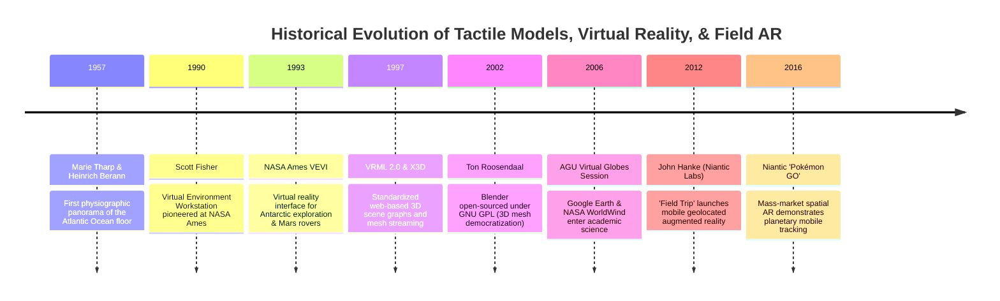

# Chapter 35: Accessibility, Physical/Tactile Terrain Models, and Field Augmented Reality (AR)

*Bringing elevation data off the 2D monitor: inclusive design, 3D-printed/CNC solid terrain, and in-situ augmented reality.*

---

## 35.4 Historical Evolution: From Hand-Painted Relief to Niantic and Field AR

The desire to experience topography beyond a flat two-dimensional map has driven innovations in physical modeling, artistic physiography, virtual reality, and augmented reality for over seven decades. The milestones below, anchored in the `schwehr/gis-history` repository, trace how the representation of terrain progressed from mid-20th-century physiographic panoramas to immersive NASA rover interfaces and mass-market geospatial augmented reality.

---

### 35.4.1 The Artistic and Physiographic Foundation: 1957 to 1990

#### 1957: Marie Tharp and Heinrich Berann's Physiographic Panoramas
When Marie Tharp and Bruce Heezen began mapping the seafloor at Columbia University's Lamont Observatory in the 1950s, contour lines were inadequate to communicate the complex 3D architecture of mid-ocean rifts to the public:
* Collaborating with Austrian landscape painter **Heinrich Berann**, Tharp translated thousands of raw single-beam echograms into dramatic, perspective **physiographic diagrams**.
* Berann used artistic vertical exaggeration, alpine rock-shading techniques, and dynamic lighting to depict the Mid-Atlantic Ridge as a tangible, physical mountain range.
* *The Historical Impact:* Tharp and Berann's panoramic maps established the visual and conceptual bridge between mathematical depth measurements and intuitive, tangible terrain representation.

#### 1990: Scott Fisher and NASA Ames Virtual Reality
In 1990, Dr. Scott Fisher—who had previously directed the Virtual Environment Workstation (VIEW) project at NASA Ames Research Center—founded Telepresence Research:
* Fisher pioneered head-mounted displays (HMDs), 6-DoF electromagnetic head tracking, and data gloves.
* His work proved that human operators could navigate 3D virtual terrain models with intuitive, embodied presence, establishing the technological foundation for immersive planetary exploration and spatial computing.

---

### 35.4.2 Virtual Environments and Web 3D Standards: 1993 to 2002

#### 1993: NASA Ames VEVI (Virtual Environment Vehicle Interface)
Developed by the Intelligent Mechanisms Group (IMG) at NASA Ames:
* **VEVI** allowed researchers wearing stereoscopic VR headsets to remotely control the *Dante* walking robot inside the active crater of Mount Spurr volcano in Alaska and explore the sub-ice bathymetry of Antarctica's Lake Bonney.
* VEVI ingested real-time stereo photogrammetry, building 3D triangular elevation meshes that updated dynamically as the robot traversed terrain, foreshadowing modern robotic digital twin environments.

#### 1997: VRML 2.0 and X3D
The Web3D Consortium standardized the **Virtual Reality Modeling Language (VRML 2.0 / ISO 14772)** and its successor **X3D**:
* Provided the first open, text-based specification for defining 3D meshes, textures, viewpoints, and terrain elevation grids (`ElevationGrid` node) inside web browsers.
* Enabled universities and geological surveys to publish interactive 3D terrain flythroughs on the early World Wide Web.

#### 2002: Ton Roosendaal and the Open-Sourcing of Blender
In 2002, Dutch developer Ton Roosendaal founded the Blender Foundation and launched a historic crowdfunding campaign to liberate the proprietary 3D animation software **Blender** under the GNU General Public License (GPL):
* Blender became the world's most versatile, open-source 3D mesh modeling suite.
* With community extensions like `BlenderGIS` and 3D printing toolboxes, Blender transformed the digital elevation ecosystem, allowing surveyors to perform watertight manifold extrusions, boolean mesh union operations, and photorealistic Cycles ray-tracing at zero licensing cost.

---

### 35.4.3 The Virtual Globe and Mobile Augmented Reality Revolution: 2006 to 2016

#### 2006: The AGU Virtual Globes Landmark Session
At the December 2006 American Geophysical Union (AGU) Fall Meeting in San Francisco, earth scientists convened the first dedicated scientific session on **"Virtual Globes in Geosciences"**:
* Marked the formal scientific acceptance of **Google Earth** and **NASA WorldWind** as legitimate tools for planetary exploration, earthquake fault mapping, and public hazard communication.
* Established the transition from static 2D paper map sheets to continuous, multiresolution, interactive 3D virtual globes.

#### 2012–2016: John Hanke, Niantic, and *Pokémon GO*
Following Google's acquisition of Keyhole Inc., Keyhole co-founder **John Hanke** founded **Niantic Labs** inside Google:
* **2012: *Field Trip*:** Niantic launched *Field Trip*, the first major mobile app to run in the background on smartphones, using GPS and geofences to alert users to historical landmarks and local geology as they walked through cities.
* **2016: *Pokémon GO*:** In July 2016, Niantic released *Pokémon GO*. The game became a global cultural phenomenon, downloaded over **500 million times** in its first six months.
* *The Technical Breakthrough:* *Pokémon GO* served as the proving ground for planetary-scale mobile augmented reality. It proved that consumer smartphones—equipped with standard cameras, low-cost IMUs, and cellular GNSS—could track user pose, project 3D digital objects onto physical terrain, and sustain cloud-native spatial query loads across hundreds of millions of concurrent global users, paving the way for professional industrial field AR.
