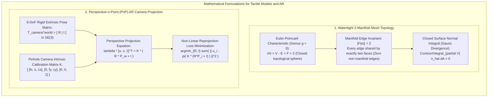

# Chapter 35: Accessibility, Physical/Tactile Terrain Models, and Field Augmented Reality (AR)

*Bringing elevation data off the 2D monitor: inclusive design, 3D-printed/CNC solid terrain, and in-situ augmented reality.*

---

## 35.5 Mathematical Foundations of Manifold Mesh Topology and AR Projection

Fabricating physical terrain models and projecting digital elevation models into real-time camera viewports requires rigorous mathematical foundations in differential topology and projective geometry. This section derives the **Euler-Poincaré 2-manifold condition** and **closed normal integral** for watertight 3D printing, and formulates the **Perspective-n-Point (PnP) camera projection** that locks virtual elevation models to the physical world in field augmented reality.

---

### 35.5.1 Watertight Manifold Topology for Physical Fabrication

In additive manufacturing (3D printing) and subtractive CNC toolpath generation, a slicing engine computes horizontal planar cross-sections through the model. If the input triangular mesh contains holes, self-intersections, inverted normals, or non-manifold edges, the interior volume is mathematically undefined.

#### 1. The Euler-Poincaré Characteristic
Let a closed, orientable polyhedral mesh representing a solid physical terrain model have $V$ vertices, $E$ edges, and $F$ triangular facets. For any closed topological surface of genus $g$ (where $g = 0$ corresponds to a simple solid sphere with zero holes/handles):

$$\chi = V - E + F = 2 - 2g$$

For a standard, unperforated terrain model ($g = 0$):

$$\chi = V - E + F = 2$$

#### 2. The Local Manifold Invariants
A triangular mesh is a **watertight 2-manifold** if and only if every point on the surface has an open neighborhood homeomorphic to an open disk in $\mathbb{R}^2$:
1. **The Edge Manifold Condition:** Every edge $e \in E$ must be bounded by **exactly two triangular faces**:
   $$|\mathcal{F}(e)| = 2, \quad \forall e \in E$$
   * If $|\mathcal{F}(e)| = 1$: The edge is a **boundary edge** (the mesh is open, creating a hole).
   * If $|\mathcal{F}(e)| \ge 3$: The edge is a **non-manifold T-junction**, creating intersecting internal walls that crash slicing engines.
2. **The Vertex Manifold Condition:** For every vertex $v \in V$, the set of incident faces must form a single, contiguous, non-self-intersecting umbrella fan.
3. **Face-Edge Ratio in Closed Triangular Meshes:**
   Because each triangle has 3 edges and each edge is shared by 2 triangles:
   $$2 E = 3 F \implies E = \frac{3}{2} F$$
   Substituting into the Euler characteristic ($V - \frac{3}{2}F + F = 2$):
   $$F = 2V - 4$$
   $$E = 3V - 6$$
   *This establishes the exact topological invariant: in any watertight 3D-printable terrain mesh, the number of triangular facets must equal exactly $2V - 4$.*

#### 3. The Closed Surface Normal Integral (Gauss's Divergence Theorem)
For a solid volume $\mathcal{V} \subset \mathbb{R}^3$ bounded by closed surface $\partial\mathcal{V}$, let $\hat{\mathbf{n}}$ be the outward-pointing unit normal vector. 

Under Gauss's Divergence Theorem, for any constant vector field $\mathbf{c} \in \mathbb{R}^3$:
$$\iiint_{\mathcal{V}} \big( \nabla \cdot \mathbf{c} \big) \, dV = \oint_{\partial \mathcal{V}} (\mathbf{c} \cdot \hat{\mathbf{n}}) \, dA$$

Since $\mathbf{c}$ is constant, $\nabla \cdot \mathbf{c} \equiv 0$:
$$\mathbf{c} \cdot \left( \oint_{\partial \mathcal{V}} \hat{\mathbf{n}} \, dA \right) = 0, \quad \forall \mathbf{c} \in \mathbb{R}^3$$

$$\oint_{\partial \mathcal{V}} \hat{\mathbf{n}} \, dA = \mathbf{0}$$

On a discrete triangular mesh of $F$ facets, each with area $A_j$ and outward unit normal $\hat{\mathbf{n}}_j$:

$$\sum_{j=1}^F A_j \hat{\mathbf{n}}_j = \mathbf{0}$$
* **The Mesh Repair Invariant Test:** 
  If $\left\| \sum_{j=1}^F A_j \hat{\mathbf{n}}_j \right\| > 10^{-6}$, the mesh contains inverted facet normals (pointing into the interior) or unclosed boundary holes, immediately flagging the model as unsliceable for 3D printing.

---

### 35.5.2 The Perspective-n-Point (PnP) Projection for Field AR

In field augmented reality, a virtual 3D elevation point $\mathbf{P}_w = (X_w, Y_w, Z_w)^T$ defined in global geodetic coordinates (e.g., UTM Zone 18N NAVD88) must be projected onto a 2D camera sensor pixel $\mathbf{u} = (u, v)^T$ at 60 fps.

#### 1. Extrinsic Transformation Matrix
The camera pose is defined by the rigid Euclidean transformation matrix $\mathbf{T}_{\text{camera}}^{\text{world}} \in \text{SE}(3)$ mapping world coordinates to camera coordinates:

$$\mathbf{P}_c = \begin{pmatrix} X_c \\ Y_c \\ Z_c \end{pmatrix} = \mathbf{R} \mathbf{P}_w + \mathbf{t}$$
where $\mathbf{R} \in \text{SO}(3)$ is the $3\times 3$ rotation matrix (parameterized by roll, pitch, and yaw) and $\mathbf{t} = (t_x, t_y, t_z)^T$ is the camera position vector.

#### 2. Intrinsic Pinhole Projection Matrix
The camera's internal optical geometry is modeled by the upper-triangular **intrinsic matrix $\mathbf{K} \in \mathbb{R}^{3 \times 3}$**:

$$\mathbf{K} = \begin{pmatrix} f_x & s & c_x \\ 0 & f_y & c_y \\ 0 & 0 & 1 \end{pmatrix}$$
where $f_x, f_y$ are focal lengths in pixel units, $(c_x, c_y)$ is the principal point, and $s$ is optical skew ($s \approx 0$).

The perspective projection equation relating a 3D world terrain point to a homogeneous 2D screen coordinate is:

$$\lambda \begin{pmatrix} u \\ v \\ 1 \end{pmatrix} = \mathbf{K} \big( \mathbf{R} \mathbf{P}_w + \mathbf{t} \big) = \mathbf{K} \begin{pmatrix} X_c \\ Y_c \\ Z_c \end{pmatrix}$$
where $\lambda = Z_c$ is the optical depth along the camera optical axis.

Expanding and dividing by depth $Z_c$ yields the non-linear projection function $\pi(\mathbf{P}_w)$:

$$u = f_x \frac{X_c}{Z_c} + c_x = f_x \left( \frac{R_{11} X_w + R_{12} Y_w + R_{13} Z_w + t_x}{R_{31} X_w + R_{32} Y_w + R_{33} Z_w + t_z} \right) + c_x$$

$$v = f_y \frac{Y_c}{Z_c} + c_y = f_y \left( \frac{R_{21} X_w + R_{22} Y_w + R_{23} Z_w + t_y}{R_{31} X_w + R_{32} Y_w + R_{33} Z_w + t_z} \right) + c_y$$

#### 3. Solving Camera Pose: The Perspective-n-Point (PnP) Optimization
In Visual Positioning Systems (VPS), the system detects $N$ visual keypoints in the camera image $\mathbf{u}_i = (u_i, v_i)^T$ and matches them to known 3D terrain coordinates $\mathbf{P}_{w, i}$ extracted from an airborne LiDAR DTM.

The optimal camera pose $(\mathbf{R}^*, \mathbf{t}^*)$ is solved by minimizing the **non-linear reprojection error**:

$$\big(\mathbf{R}^*, \, \mathbf{t}^*\big) = \arg\min_{\mathbf{R} \in \text{SO}(3), \, \mathbf{t} \in \mathbb{R}^3} \sum_{i=1}^N \rho_{\text{Huber}}\left( \left\| \mathbf{u}_i - \pi\big( \mathbf{K}(\mathbf{R}\mathbf{P}_{w, i} + \mathbf{t}) \big) \right\|^2 \right)$$
where $\rho_{\text{Huber}}$ is a robust loss function that rejects false keypoint matches.

Solved iteratively via the **Levenberg-Marquardt algorithm** inside a RANSAC loop, the system converges to sub-centimeter positional accuracy in milliseconds, locking virtual floodwaters, buried pipelines, and planned highway grading planes to the physical landscape.
