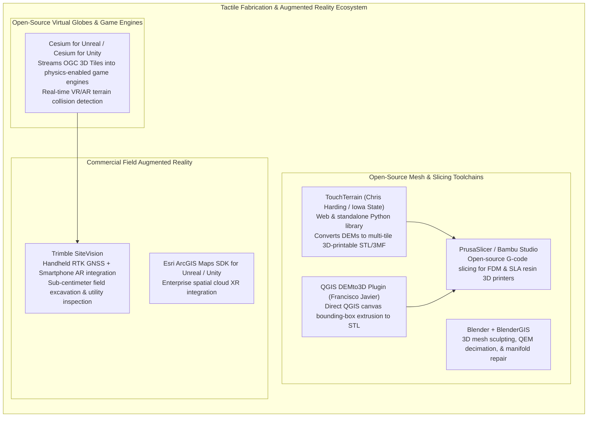

# Chapter 35: Accessibility, Physical/Tactile Terrain Models, and Field Augmented Reality (AR)

*Bringing elevation data off the 2D monitor: inclusive design, 3D-printed/CNC solid terrain, and in-situ augmented reality.*

---

## 35.6 Software Ecosystem

Building physical tactile terrain models and deploying field augmented reality systems requires software capable of converting 2.5D raster matrices into watertight 3D geometry, slicing solid meshes for 3D printers, and streaming massive geospatial tiles into real-time game engines. This section reviews the open-source tools and enterprise AR platforms that bridge digital elevation models with physical reality.



---

### 35.6.1 Open-Source Tactile Fabrication Tools

#### 1. `TouchTerrain`
Developed by Dr. Chris Harding at Iowa State University, **`TouchTerrain`** is the standard open-source Python library and web application for fabricating 3D terrain models:
* Directly queries AWS Terrain Tiles and USGS 3DEP, allowing users to draw a bounding box anywhere on Earth.
* Applies user-specified **Vertical Exaggeration ($VE$)** and baseplate thickness.
* Automatically tiles massive geographic regions into interlocking multi-piece puzzle blocks that fit within small desktop 3D printer build volumes ($20\text{ cm} \times 20\text{ cm}$), complete with alignment dowel holes.

#### 2. QGIS `DEMto3D` Plugin
Developed by Francisco Javier Venceslá:
* Operates natively within the QGIS desktop environment.
* Allows cartographers to select an active DEM layer, define printing dimensions in millimeters (e.g., $150\text{ mm} \times 100\text{ mm}$), establish model scale (e.g., $1:50,000$), specify vertical exaggeration, and export a clean, watertight `.stl` file.

#### 3. Standalone Python Mesh Extrusion Script
The script below demonstrates how to convert a 2.5D elevation array into a closed, watertight 3D manifold mesh (Wavefront OBJ format) by extruding vertical side skirt walls down to a flat baseplate:

```python
"""
Convert a 2.5D elevation raster into a watertight 3D solid manifold mesh (OBJ).
Extrudes side walls down to a flat baseplate elevation and closes the bottom.
Guarantees Euler-Poincaré 2-manifold condition (V - E + F = 2).
"""

import numpy as np

def dem_to_watertight_obj(
    dem: np.ndarray,
    dx: float,
    dy: float,
    output_obj_path: str,
    base_margin: float = 5.0,
    vertical_exaggeration: float = 2.0
):
    """
    Extrudes an elevation grid into a watertight 3D solid OBJ file.
    
    Args:
        dem: 2D array of elevation values (meters).
        dx, dy: Horizontal pixel resolution (meters).
        output_obj_path: Destination path for .obj file.
        base_margin: Thickness in meters below minimum elevation for baseplate.
        vertical_exaggeration: Vertical scaling factor.
    """
    ny, nx = dem.shape
    z_min = float(np.min(dem))
    z_base = z_min - base_margin
    
    # 1. Generate Top Surface Vertices (Indices 1 to nx * ny)
    vertices = []
    for j in range(ny):
        y = (ny - 1 - j) * dy
        for i in range(nx):
            x = i * dx
            z = z_base + vertical_exaggeration * (float(dem[j, i]) - z_base)
            vertices.append((x, y, z))
            
    # 2. Generate Bottom Baseplate Vertices (Indices nx * ny + 1 to 2 * nx * ny)
    base_offset = nx * ny
    for j in range(ny):
        y = (ny - 1 - j) * dy
        for i in range(nx):
            x = i * dx
            vertices.append((x, y, z_base))
            
    faces = []
    
    # Helper to convert 2D index (i, j) to 1-based OBJ vertex index
    def v_top(i, j): return j * nx + i + 1
    def v_bot(i, j): return base_offset + j * nx + i + 1
    
    # 3. Top Surface Triangles (Outward normal pointing UP)
    for j in range(ny - 1):
        for i in range(nx - 1):
            faces.append((v_top(i, j), v_top(i, j+1), v_top(i+1, j)))
            faces.append((v_top(i+1, j), v_top(i, j+1), v_top(i+1, j+1)))
            
    # 4. Bottom Baseplate Triangles (Outward normal pointing DOWN)
    for j in range(ny - 1):
        for i in range(nx - 1):
            faces.append((v_bot(i, j), v_bot(i+1, j), v_bot(i, j+1)))
            faces.append((v_bot(i+1, j), v_bot(i+1, j+1), v_bot(i, j+1)))
            
    # 5. Four Vertical Skirt Walls (Connecting perimeter edges)
    # North Wall (j = 0)
    for i in range(nx - 1):
        faces.append((v_top(i, 0), v_top(i+1, 0), v_bot(i, 0)))
        faces.append((v_top(i+1, 0), v_bot(i+1, 0), v_bot(i, 0)))
    # South Wall (j = ny - 1)
    for i in range(nx - 1):
        faces.append((v_top(i, ny-1), v_bot(i, ny-1), v_top(i+1, ny-1)))
        faces.append((v_top(i+1, ny-1), v_bot(i, ny-1), v_bot(i+1, ny-1)))
    # West Wall (i = 0)
    for j in range(ny - 1):
        faces.append((v_top(0, j), v_bot(0, j), v_top(0, j+1)))
        faces.append((v_top(0, j+1), v_bot(0, j), v_bot(0, j+1)))
    # East Wall (i = nx - 1)
    for j in range(ny - 1):
        faces.append((v_top(nx-1, j), v_top(nx-1, j+1), v_bot(nx-1, j)))
        faces.append((v_top(nx-1, j+1), v_bot(nx-1, j+1), v_bot(nx-1, j)))
        
    # Write to Wavefront OBJ format
    print(f"Writing watertight manifold OBJ: {len(vertices):,} vertices, {len(faces):,} facets...")
    with open(output_obj_path, "w") as f:
        f.write("# Watertight Manifold 3D Terrain Solid\n")
        for v in vertices:
            f.write(f"v {v[0]:.4f} {v[1]:.4f} {v[2]:.4f}\n")
        for face in faces:
            f.write(f"f {face[0]} {face[1]} {face[2]}\n")
            
    print(f"Successfully generated 3D printable model: {output_obj_path}")

# Example generation:
# dem_test = np.random.uniform(100, 150, size=(50, 50))
# dem_to_watertight_obj(dem_test, dx=10.0, dy=10.0, output_obj_path="terrain_solid.obj")
```

---

### 35.6.2 Augmented Reality and Virtual Globe Engines

#### 1. Cesium for Unreal and Cesium for Unity
Open-source plug-ins connecting game engines with global geospatial data:
* Streams **OGC 3D Tiles** and high-resolution Quantized-Mesh terrain directly into Epic Games' Unreal Engine 5 and Unity.
* Automatically creates physical **mesh colliders** matching the terrain geometry, enabling real-time physics simulation (vehicles driving over LiDAR terrain, simulated water flow, and flight simulation).
* Integrates dynamic georeferencing matrices that convert WGS84 ECEF coordinates into local game-engine coordinates without floating-point precision loss.

#### 2. Trimble SiteVision
The industry-leading commercial field augmented reality system:
* Integrates a handheld geodetic antenna (Catalyst GNSS) with a mobile smartphone running Google ARCore.
* Computes dual-frequency RTK carrier-phase corrections in real time, locking the camera's 6-DoF pose matrix to within **$<2\text{ centimeters}$** horizontally and vertically.
* Displays holographic cut/fill color maps, underground utility vectors, and proposed building models directly over the live camera video stream on construction sites.
