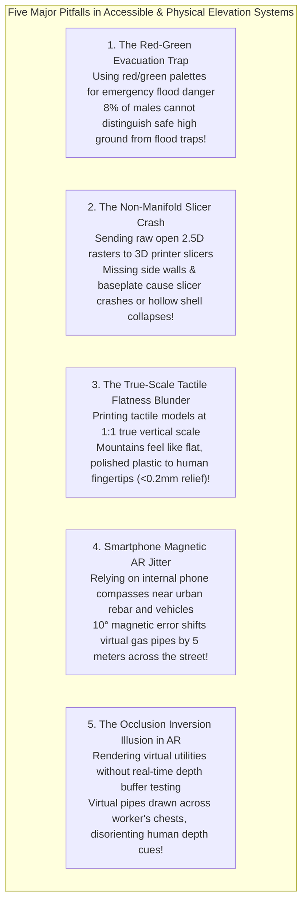

# Chapter 35: Accessibility, Physical/Tactile Terrain Models, and Field Augmented Reality (AR)

*Bringing elevation data off the 2D monitor: inclusive design, 3D-printed/CNC solid terrain, and in-situ augmented reality.*

---

## 35.7 Common Pitfalls and Key Takeaways

Extending digital elevation models into physical tactile matter and augmented reality viewports introduces physical and physiological failure modes unknown to traditional 2D GIS. When systems ignore color vision deficiencies, non-manifold geometry, or magnetic compass drift, the consequences range from civil construction utility strikes to life-threatening evacuation failures.

---

### 35.7.1 Common Pitfalls in Accessibility, Tactile Fabrication, and Field AR

#### 1. The Red-Green Evacuation Hazard Trap
* **The Failure Mode:** An emergency management agency releases a high-resolution coastal storm surge map, color-coding safe high-ground elevations in **Green** and dangerous flood inundation zones in **Red**.
* **Physiological Reality:** Approximately **$8\%$ of men and $0.5\%$ of women** have red-green color vision deficiency (deuteranomaly or protanomaly).
* **Forensic Consequence:** Under deuteranopic vision, both the red hazard zones and the green safe zones collapse into an identical, muddy brownish-yellow hue. Residents attempting to navigate evacuation routes in the dark cannot distinguish safe highland corridors from submerged, lethal lowlands.
* **Remedy:** Ban unassisted red-green color scales. Enforce **WCAG 2.2 dual-encoding**: pair colorblind-safe monotonic palettes (`viridis`, `batlow`, `cividis`) with clear vector hatching, labeled elevation contours, and explicit textual warnings.

#### 2. The Non-Manifold Slicer Crash
* **The Failure Mode:** A GIS technician exports an elevation grid as a surface mesh and directly imports the file into a 3D printer slicing engine (PrusaSlicer, Cura, Bambu Studio) without extruding solid boundary walls.
* **Geometric Reality:** A 2.5D raster is an open surface (infinitesimal thickness). Slicing engines compute 2D planar intersections through a solid closed volume.
* **Forensic Consequence:** The slicer's computational geometry kernel detects non-manifold boundary edges ($|\mathcal{F}(e)| = 1$). The slicing engine either crashes with a memory segmentation fault or slices a paper-thin, fragile shell with zero bottom support that collapses into a bird's nest of melted plastic during printing.
* **Remedy:** Always pass elevation rasters through automated **watertight manifold extrusion scripts** (`TouchTerrain`, `DEMto3D`), generating vertical side skirt walls and a flat baseplate ensuring $V - E + F = 2$.

#### 3. The True-Scale Tactile Flatness Blunder
* **The Failure Mode:** A well-meaning educator 3D-prints a physical tactile map of a state or national park at true 1:1 physical scale without applying vertical exaggeration, intending to give blind students an "unbiased" tactile model.
* **Somatosensory Reality:** The human fingertip requires a vertical relief step of at least **$0.5\text{ to }1.0\text{ millimeters}$** to perceive topographic variation.
* **Forensic Consequence:** On a $20\text{-cm}$ wide model of a $100\text{-km}$ mountainous region ($1:500,000$ scale), a massive $1,000\text{-meter}$ mountain ridge corresponds to a physical bump of only **$2.0\text{ millimeters}$**, while rolling hills and river valleys have relief of less than $0.1\text{ mm}$. To the blind student's touch, the model feels like a completely flat, featureless sheet of smooth plastic.
* **Remedy:** Apply mandatory **Vertical Exaggeration ($VE = 2\times\text{ to }10\times$)** based on BANA tactile cartography guidelines, amplifying slopes so they cross the somatosensory perception threshold.

#### 4. The Smartphone Compass AR Jitter Nightmare
* **The Failure Mode:** A field utility inspection team uses a consumer smartphone AR application to mark the locations of buried underground high-pressure gas pipes before backhoe excavation.
* **Physical Reality:** Consumer smartphones rely on internal micro-machined magnetic compasses. On an urban street, magnetic heading is heavily distorted by subterranean metallic pipes, steel rebar in concrete sidewalks, parked vehicles, and overhead electric transit lines, introducing magnetic heading errors of **$\pm 5^\circ\text{ to }\pm 15^\circ$**.
* **Forensic Consequence:** At a viewing distance of only $20\text{ meters}$, an uncorrected $12^\circ$ heading error shifts the virtual pipeline projection horizontally by:
  $$\Delta x = 20\text{ m} \times \tan(12^\circ) \approx \mathbf{4.25\text{ meters}}$$
  The holographic gas main appears safely beneath the sidewalk, when in physical reality it runs directly beneath the roadway. The backhoe operator digs into the street and punctures the gas line, causing an explosion.
* **Remedy:** Never rely on consumer smartphone magnetic compasses for subsurface infrastructure AR. Mandate **dual-antenna GNSS RTK heading** or **Visual Positioning Systems (VPS)** coupled with high-frequency Visual-Inertial Odometry (VIO).

#### 5. The Occlusion Inversion Illusion in AR
* **The Failure Mode:** An augmented reality engine projects a virtual flood inundation surface or proposed highway embankment into a tablet camera feed without reading the device's hardware depth sensor.
* **Perceptual Reality:** The human brain reconstructs depth hierarchy using occlusion cues: an object that obscures another is perceived as closer.
* **Forensic Consequence:** If a construction surveyor walks in front of the camera, the virtual CAD model is rendered directly on top of the real human. The observer's brain perceives an impossible optical contradiction: the person's feet touch the real ground in the foreground, but the virtual hill appears painted across their torso. Depth perception collapses, inducing severe operator eye fatigue and motion sickness.
* **Remedy:** Enforce **real-time depth buffer occlusion testing** using mobile LiDAR or Time-of-Flight (ToF) sensors, dynamically masking out virtual geometries that sit behind physical real-world foreground objects.

---

### 35.7.2 Key Takeaways for Practitioners

1. **Design for Color Vision Deficiency:** Never use color as the sole conveyor of elevation or hazard. Guarantee monotonic luminance ($L^*$) and apply dual-encoding (contours, textures, text) under WCAG 2.2 rules.
2. **Watertight Manifold Topology Is Mandatory:** 3D printing requires closed volumes ($V - E + F = 2$ and $\oint \hat{\mathbf{n}} dA = \mathbf{0}$). Extrude vertical skirts and flat baseplates before slicing.
3. **Tactile Models Require Vertical Exaggeration:** Real terrain is too flat for fingertip perception. Apply $VE = 2\times\text{ to }10\times$ and integrate standardized $0.5\text{-mm}$ Braille annotations.
4. **Field AR Requires Centimeter Georeferencing:** Never rely on smartphone magnetic compasses. Field excavation AR requires survey-grade RTK GNSS combined with Visual-Inertial Odometry ($<2\text{ cm}$ precision).
5. **Enforce Dynamic Depth Occlusion:** Use mobile LiDAR depth buffers to mask virtual terrain layers behind real-world physical foreground obstacles.
